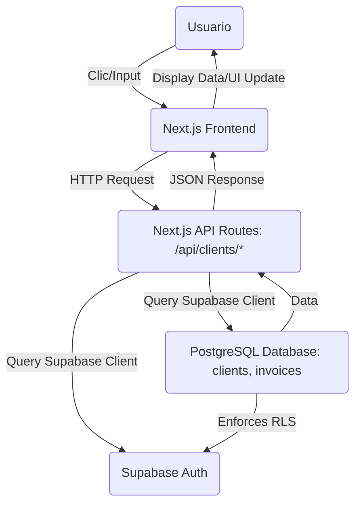

# Feature Test Plan: EPIC-SQ-13 - Client Management

**Fecha:** 2026-02-07
**QA Lead:** AI-Generated
**Epic Jira Key:** [SQ-13](https://upexgalaxy64.atlassian.net/browse/SQ-13)
**Status:** Draft - Pending Team Review

---

## 📋 Business Context Analysis

### Business Value

Esta épica es **fundamental** para el flujo de facturación de SoloQ. Permite a los freelancers latinoamericanos organizar y gestionar su base de clientes, un paso crítico después de la autenticación de usuario y antes de la creación de facturas.

**Key Value Proposition:**

- **Organización:** Permite a freelancers mantener un registro profesional y actualizado de sus clientes.
- **Eficiencia:** Reduce el tiempo y el esfuerzo necesarios para crear facturas al tener los datos del cliente accesibles y pre-cargados.
- **Visibilidad:** Ofrece una visión del historial de facturación con cada cliente, proporcionando contexto para la gestión de relaciones.

**Success Metrics (KPIs impactados):**

- **Time to First Invoice:** Impacta positivamente al simplificar la selección y gestión de clientes.
- **MAU (Monthly Active Users):** Usuarios que utilizan activamente la gestión de clientes serán usuarios recurrentes de la plataforma.
- **Retention D7:** Una buena experiencia de gestión de clientes contribuye a la retención.

**User Impact:**

- **Carlos (Diseñador Organizado):** Necesita agregar clientes rápidamente y asegurarse de que los datos de facturación estén correctos para mantener su imagen profesional. Se beneficia de la facilidad de añadir y editar clientes.
- **Valentina (Desarrolladora Internacional):** Gestiona clientes diversos y necesita añadir datos fiscales específicos para algunos. Valora la capacidad de tener toda la información consolidada y el historial de facturas.
- **Andrés (Consultor Tradicional):** Con 8-12 clientes, valora la lista organizada y la capacidad de buscar rápidamente un cliente para facturar o ver su estado de pagos. Se beneficia de la lista y la búsqueda.

**Critical User Journeys:**

- **Journey 1: "Registro y Primera Factura"**: Los pasos 8 (Crear Cliente) y 9 (Agregar Datos del Cliente) dependen directamente de esta épica.
- **Journey 2: "Seguimiento y Cobro de Factura"**: La identificación de clientes para seguimiento y el contexto de su relación se facilita con esta épica.
- **Journey 4: "Edición de Factura"**: La edición de datos de una factura puede requerir la verificación o modificación de datos del cliente, lo que se gestiona aquí.

---

## 🏗️ Technical Architecture Analysis

### Architecture Components Involved

**Frontend:**

- **Páginas:** `/clients` (lista), `/clients/create` (crear), `/clients/[id]` (detalle/editar), `/clients/[id]/invoices` (historial).
- **Componentes:** `ClientForm` (reutilizable para crear/editar), `ClientsTable`, `ClientsSearch`, `DeleteClientDialog`, `TaxIdInput`, `ClientInvoiceHistory`.
- **Formularios:** `React Hook Form` con `Zod` para validación client-side.
- **Manejo de estado:** `@tanstack/react-query` para gestionar el estado del servidor (caching, mutaciones).

**Backend - API Endpoints:**

| Method | Endpoint                    | Description                                             | Functional Requirement (SRS)                 |
| ------ | --------------------------- | ------------------------------------------------------- | -------------------------------------------- |
| GET    | `/api/clients`              | Listar clientes con búsqueda, paginación, ordenamiento. | FR-011                                       |
| POST   | `/api/clients`              | Crear nuevo cliente.                                    | FR-010                                       |
| GET    | `/api/clients/:id`          | Obtener detalles de un cliente específico.              | FR-012 (implícito en la necesidad de editar) |
| PUT    | `/api/clients/:id`          | Actualizar datos de un cliente existente.               | FR-012                                       |
| DELETE | `/api/clients/:id`          | Eliminar cliente (soft delete).                         | FR-013                                       |
| GET    | `/api/clients/:id/invoices` | Obtener historial de facturas de un cliente.            | FR-014                                       |

**Database:**

- **Tabla principal:** `clients`
  - Columnas clave: `id`, `user_id`, `name`, `email`, `company`, `phone`, `address`, `tax_id`, `tax_id_type`, `notes`, `is_deleted`, `created_at`, `updated_at`, `deleted_at`.
  - Constraint: `UNIQUE(user_id, email)` (asegura que un usuario no tenga dos clientes con el mismo email).
- **RLS Policy:** `auth.uid() = user_id` (para asegurar aislamiento de datos entre usuarios).
- **Integración con `invoices`:** Clave foránea `client_id` en `invoices` referenciando a `clients`.

**External Services:**

- **Supabase Auth:** Autenticación y gestión de sesiones para `user_id` en RLS.
- **Supabase Database (PostgreSQL):** Base de datos principal.

### Integration Points (Critical for Testing)

**Internal Integration Points:**

- **Frontend ↔ Backend API:** Todas las interacciones del UI con los 6 endpoints `/api/clients/*`.
- **Backend API ↔ PostgreSQL:** Consultas, inserciones, actualizaciones y "soft delete" en la tabla `clients`.
- **Backend API ↔ Supabase Auth:** Para enforcement de RLS y obtención del `user_id` de la sesión.
- **`clients` tabla ↔ `invoices` tabla:** Integridad referencial (`client_id` como FK), impacto del "soft delete" en el historial de facturas.

**Data Flow:**



---

## 🚨 Risk Analysis

### Technical Risks

#### Risk 1: Fallo en Políticas de RLS (Fuga de Datos)

- **Impact:** HIGH
- **Likelihood:** Medium
- **Area Affected:** Security, Database, Backend
- **Mitigation Strategy:**
  - Implementar tests de integración y E2E específicos de RLS con múltiples usuarios, intentando el acceso y modificación de datos de otros usuarios.
  - Revisión de código exhaustiva de todas las políticas RLS.
- **Test Coverage Required:** Tests de seguridad multi-usuario para `GET`, `POST`, `PUT`, `DELETE` en `/api/clients/*`.

#### Risk 2: Duplicado de Clientes Inesperado (violación de UNIQUE constraint)

- **Impact:** Medium
- **Likelihood:** Medium
- **Area Affected:** Database, Backend, Frontend
- **Mitigation Strategy:**
  - Implementar `UNIQUE(user_id, email)` a nivel de base de datos.
  - Verificación explícita en el backend (previo a la inserción/actualización) si el email ya existe para el `user_id` actual.
  - Manejar la respuesta `409 Conflict` de la API con un mensaje user-friendly.
- **Test Coverage Required:** Test cases negativos para creación y edición con emails duplicados.

#### Risk 3: Degradación de Rendimiento en Listado de Clientes

- **Impact:** Medium
- **Likelihood:** Low (para la mayoría de los usuarios)
- **Area Affected:** Backend, Database, Frontend
- **Mitigation Strategy:**
  - Implementar paginación en el endpoint `GET /api/clients`.
  - Asegurar que las columnas `name`, `email`, `user_id` tengan índices adecuados en la tabla `clients`.
  - Implementar "debounce" en el search box del frontend para evitar consultas excesivas.
- **Test Coverage Required:** Test cases de paginación y búsqueda con volúmenes de datos medios (ej. 100 clientes) para medir rendimiento.

### Business Risks

#### Risk 1: Frustración del Usuario por Validación de Tax ID

- **Impact on Business:** Abandono del formulario, datos incompletos.
- **Impact on Users:** Valentina (dev) y Andrés (consultor) que necesitan datos fiscales.
- **Likelihood:** Medium
- **Mitigation Strategy:**
  - Usar validación basada en Regex por país (como se definió en `feature-implementation-plan.md`).
  - Proporcionar texto de ayuda (helper text) y máscaras de entrada si es posible.
- **Acceptance Criteria Validation:** Validar mensajes de error claros y que el campo sea opcional si no hay validación estricta.

#### Risk 2: Confusión al Eliminar un Cliente

- **Impact on Business:** Pérdida de datos importantes para la contabilidad si el cliente tenía facturas.
- **Impact on Users:** Cualquier usuario que intente limpiar su lista.
- **Likelihood:** Medium
- **Mitigation Strategy:**
  - Implementar "soft delete" para preservar la integridad referencial.
  - Proporcionar un diálogo de confirmación claro que indique si el cliente tiene facturas asociadas.
- **Test Coverage Required:** Test cases para "soft delete" y para la eliminación de clientes con y sin facturas.

### Integration Risks

#### Integration Risk 1: Inconsistencia entre Clientes y Facturas (tras Soft Delete)

- **Integration Point:** `clients` tabla ↔ `invoices` tabla
- **What Could Go Wrong:** Facturas de clientes "soft-deleted" no se muestran correctamente o causan errores al intentar acceder a ellas.
- **Impact:** Medium
- **Mitigation:**
  - Asegurar que las consultas de facturas puedan acceder a clientes "soft-deleted" si es necesario (ej. para mostrar el historial del cliente), pero que la lista principal de clientes no los muestre.
  - Verificar que la clave foránea `client_id` en `invoices` tiene `ON DELETE NO ACTION` o `RESTRICT` si se decide usar hard delete en el futuro, o si la política de "soft delete" lo exige.
- **Test Coverage Required:** Tests de integración para `GET /api/clients/:id/invoices` con clientes que han sido "soft-deleted".

---

## ⚠️ Critical Analysis & Questions for PO/Dev

### Ambiguities Identified

**Ambiguity 1:** Comportamiento detallado de la búsqueda (`SQ-15`)

- **Found in:** STORY-SQ-15
- **Question for Dev:** La búsqueda en la lista de clientes (`GET /api/clients?search=...`) ¿es _case-insensitive_? ¿Realiza búsqueda _parcial_ (ej. "jo" encuentra "John")? ¿En qué campos busca (solo nombre, o nombre y email y empresa)?
- **Impact if not clarified:** Expectativas de la funcionalidad de búsqueda no alineadas, lo que podría llevar a una UX deficiente o a test cases incompletos.

**Ambiguity 2:** Ordenamiento por defecto de la lista de clientes (`SQ-15`)

- **Found in:** STORY-SQ-15
- **Question for PO:** ¿Cuál debe ser el orden por defecto de la lista de clientes cuando se carga la página `/clients`? ¿Alfabético por nombre (A-Z)? ¿Por fecha de creación (más recientes primero)?
- **Impact if not clarified:** La UI podría no mostrar los clientes de la manera más útil inicialmente para el usuario.

**Ambiguity 3:** Comportamiento al editar email de cliente a uno ya existente (`SQ-16`)

- **Found in:** STORY-SQ-16 (Technical Notes menciona "Same validation as create")
- **Question for PO/Dev:** Si un usuario edita un cliente y le asigna un email que ya pertenece a _otro cliente del mismo usuario_, ¿cuál es el mensaje de error esperado y el status code de la API? ¿Debe ser `409 Conflict`?
- **Impact if not clarified:** Incertidumbre sobre cómo la API y el UI deben manejar este escenario de error crítico.

### Missing Information

**Missing 1:** Mensajes de error específicos para validaciones de campos (`SQ-14`, `SQ-16`)

- **Needed for:** UI/UX consistente y pruebas precisas.
- **Suggestion:** Definir mensajes de error exactos para cada validación (ej. "El nombre debe tener al menos 2 caracteres", "Ingresa un email válido"). (Ya se propusieron en `implementation-plan.md` para SQ-14, verificar si se aplican a SQ-16).

**Missing 2:** Texto y comportamiento del CTA en empty state de clientes (`SQ-15`)

- **Needed for:** Claridad en la UI y pruebas E2E.
- **Suggestion:** Especificar el texto exacto del CTA (ej. "Agregar tu primer cliente") y la acción (ej. redirigir a `/clients/create` o abrir un modal de creación).

### Suggested Improvements (Before Implementation)

#### Improvement 1: Agregar validación de formato para `tax_id` (`SQ-17`)

- **Story Affected:** SQ-17
- **Current State:** "The tax ID is validated and saved" (AC) pero "Optional field" (Technical Notes). `implementation-plan.md` del épica propone Regex por país.
- **Suggested Change:** Asegurar que el formulario y la API implementen la validación de formato `tax_id` por país como se describe en la decisión técnica del feature implementation plan, incluso si el campo es opcional.
- **Benefit:** Reduce errores de entrada de datos y mejora la calidad de la información fiscal.

#### Improvement 2: Confirmación informativa en "Soft Delete" (`SQ-19`)

- **Story Affected:** SQ-19
- **Current State:** "Confirmation dialog" (AC)
- **Suggested Change:** El diálogo de confirmación de eliminación (`DeleteClientDialog`) debería indicar claramente al usuario si el cliente que está a punto de eliminar tiene facturas asociadas, y explicar que, debido a esto, el cliente solo será "ocultado" (soft-deleted) y no borrado permanentemente.
- **Benefit:** Mayor transparencia y mejor experiencia de usuario al gestionar clientes con historial.

---

## 🎯 Test Strategy

### Test Scope

**In Scope:**

- **Functional testing:** Todas las operaciones CRUD (crear, listar, editar, eliminar) de clientes.
- **Integration testing:** Comunicación entre Frontend, API Backend y Base de Datos (PostgreSQL), incluyendo Supabase Auth/RLS.
- **Security testing:** Aislamiento de datos (RLS) y autenticación.
- **Validation testing:** Formatos de input, campos requeridos, límites (longitud, duplicados).
- **Cross-browser testing:** Chrome, Firefox, Safari (en desktop) y iOS Safari, Android Chrome (en móvil).
- **Mobile responsiveness:** El layout y la funcionalidad se adaptan a dispositivos móviles.
- **API contract validation:** Todos los endpoints de la épica (`/api/clients/*`) cumplen con `api-contracts.yaml`.
- **Error handling:** Mensajes de error amigables para el usuario y logs adecuados en backend.

**Out of Scope (For This Epic):**

- Pruebas de carga/rendimiento a gran escala (más allá de la paginación básica).
- Pruebas de estrés.
- Testing de penetración.
- Testing de facturas (cubierto en EPIC-SOLOQ-004).
- Testing de pago (cubierto en EPIC-SOLOQ-008).

### Test Levels

#### Unit Testing

- **Coverage Goal:** > 80% code coverage.
- **Focus Areas:** Validaciones `Zod` (`client.ts`, `tax-id.ts`), funciones de formateo, lógica de negocio compleja en helpers, custom hooks (`useCreateClient`, `useClients`, etc.).
- **Responsibility:** Dev team (QA valida que existan y pasen).

#### Integration Testing

- **Coverage Goal:** Todos los 6 endpoints de API (`/api/clients/*`) identificados en la arquitectura.
- **Focus Areas:**
  - Comunicación Frontend ↔ Backend API (verificar payloads y respuestas).
  - Backend API ↔ Database (persistencias, updates, soft deletes, consultas).
  - RLS enforcement: Asegurar que `auth.uid() = user_id` aísla correctamente los datos.
  - Integridad referencial: Comprobar el comportamiento de eliminación de clientes con facturas.
- **Responsibility:** QA + Dev (idealmente, QA crea tests de API y Dev los integra).

#### End-to-End (E2E) Testing

- **Coverage Goal:** Los user journeys críticos para la gestión de clientes.
- **Tool:** Playwright.
- **Focus Areas:**
  - **User Journey 1 (Agregar primer cliente):** Navegar a `/clients` (empty state) -> clic CTA -> `/clients/create` -> rellenar formulario -> guardar -> toast éxito -> redirigir a `/clients` -> nuevo cliente visible.
  - **User Journey 2 (Buscar y editar cliente):** Navegar a `/clients` -> buscar cliente -> clic en fila -> `clients/[id]` -> clic "Editar" -> modificar datos -> guardar -> toast éxito -> datos actualizados.
  - **User Journey 3 (Ver historial de facturas):** Navegar a `/clients/[id]` -> clic "Ver historial" -> `clients/[id]/invoices` -> lista de facturas visible.
  - Escenarios críticos de error (email duplicado, validación de campos).
- **Responsibility:** QA team.

#### API Testing

- **Coverage Goal:** 100% de los endpoints de la épica según `api-contracts.yaml`.
- **Tool:** Postman/Newman o Playwright API testing.
- **Focus Areas:**
  - Validación de contrato (request/response según OpenAPI spec).
  - Códigos de estado HTTP correctos (200 OK, 201 Created, 400 Bad Request, 401 Unauthorized, 404 Not Found, 409 Conflict).
  - Manejo de errores específicos (ej. mensaje para email duplicado).
  - Autenticación y autorización (verificar que `BearerAuth` funciona y RLS es efectivo).
- **Responsibility:** QA team.

### Test Types per Story

| Story                       | Complexity | Positive TC | Negative TC | Boundary TC | Integration/API TC | Total TC (aprox) | Parametrizados         |
| :-------------------------- | :--------- | :---------- | :---------- | :---------- | :----------------- | :--------------- | :--------------------- |
| SQ-14: Add New Client       | Medium     | 2           | 3           | 2           | 2                  | 9                | Email Invalido         |
| SQ-15: List All Clients     | Medium     | 4           | 1           | 2           | 3                  | 10               | Búsqueda, Ordenamiento |
| SQ-16: Edit Client Data     | Low        | 2           | 3           | 2           | 2                  | 9                | Email Invalido         |
| SQ-17: Add Client Tax Info  | Low        | 2           | 1           | 1           | 1                  | 5                | Tax ID Formatos        |
| SQ-18: View Invoice History | Medium     | 2           | 1           | 1           | 2                  | 6                | -                      |
| SQ-19: Delete Client        | Medium     | 2           | 1           | 1           | 2                  | 6                | -                      |
| **Total Estimado**          |            | **14**      | **10**      | **9**       | **12**             | **45**           |                        |

**Rationale for estimate:**
La épica es de complejidad media con funcionalidades CRUD estándar. Los test cases se centran en cubrir happy paths, validaciones exhaustivas, manejo de duplicados, soft-delete y, crucialmente, la seguridad de RLS y la integridad de datos. La parametrización se usará para reducir la duplicación y aumentar la cobertura en validaciones y búsqueda.

### Total Estimated Test Cases for Epic

**Total:** ~45 (aproximado)
**Breakdown:**

- Positive: 14
- Negative: 10
- Boundary: 9
- Integration/API: 12
- Security (incluido en Integration): Al menos 2 escenarios críticos.

---

## 🗂️ Test Data Requirements

### Test Data Strategy

**Valid Data Sets:**

- **Usuarios:** userA (con clientes), userB (sin clientes), userC (con clientes para RLS).
- **Clientes:** "Carlos Diseño", "Valentina Dev", "Andres Consultor", "Empresa XYZ", "Cliente con Email Largo", "Cliente con Caracteres Especiales".
- **Emails:** Formatos válidos, emails con `+tag`, emails con subdominios.
- **Datos Opcionales:** Valores para `company`, `phone` (formatos internacionales), `address` (múltiples líneas), `notes` (textos largos).
- **Clientes con Facturas:** Para probar `SQ-18` y `SQ-19` (soft delete).
- **Clientes Soft-Deleted:** Para verificar que no aparecen en listados.

**Invalid Data Sets:**

- **Emails:** "not-an-email", "", "user@.com", "user@domain".
- **Nombres:** "", `null`, nombres muy largos (más de 100 caracteres).
- **Tax ID:** Formatos incorrectos para RFC, NIT, CUIT, RUT.
- **Emails Duplicados:** Intentar crear un cliente con un email ya existente para el mismo usuario.

**Boundary Data Sets:**

- **Longitud de campos:** Nombres de 2 y 100 caracteres. Emails de 255 caracteres. Teléfonos de 20 caracteres. Direcciones de 500 caracteres. Notas de 1000 caracteres.
- **Búsqueda:** Términos de búsqueda vacíos, términos con un solo carácter, términos con muchos caracteres.
- **Paginación:** 0 clientes, 1 cliente, 19 clientes, 20 clientes, 21 clientes, 40 clientes, 41 clientes, 45 clientes (para pageSize=20).

**Test Data Management:**

- **Generación:** Utilizar `Faker.js` para generar datos realistas y variados para clientes.
- **Factories:** Crear fábricas de datos para la entidad `Client` y `Invoice` (cuando corresponda).
- **Limpieza:** Implementar un mecanismo para limpiar los datos de prueba después de cada ejecución de test (o antes). Asegurar que los tests sean idempotentes.

### Test Environments

**Staging Environment:**

- **URL:** `https://staging.soloq.app`
- **Database:** `soloq-staging` (instancia de Supabase).
- **External Services:** Versiones de staging o mocks para servicios externos (si aplica).
- **Purpose:** Entorno principal para todas las pruebas de QA (funcionales, integración, E2E, seguridad).

**Production Environment:**

- **URL:** `https://soloq.app`
- **Purpose:** ÚNICAMENTE "smoke tests" post-despliegue.
- **Restrictions:** NO realizar pruebas destructivas, NO crear datos de prueba.

---

## ✅ Entry/Exit Criteria

### Entry Criteria (Per Story)

Testing puede comenzar cuando:

- [ ] La historia está completamente implementada y desplegada en staging.
- [ ] La revisión de código ha sido aprobada por 2+ revisores.
- [ ] Existen y pasan los tests unitarios (>80% de cobertura de código).
- [ ] El equipo de desarrollo ha realizado un "smoke testing" y confirma que la funcionalidad básica funciona.
- [ ] No existen "blocker bugs" en historias dependientes.
- [ ] Los datos de prueba están preparados y disponibles en staging.
- [ ] La documentación de API está actualizada (si la API tiene cambios).

### Exit Criteria (Per Story)

La historia se considera "Done" desde la perspectiva de QA cuando:

- [ ] Todos los casos de prueba (Positive, Negative, Boundary) han sido ejecutados.
- [ ] Los casos de prueba de prioridad Crítica/Alta: 100% pasan.
- [ ] Los casos de prueba de prioridad Media/Baja: ≥95% pasan.
- [ ] Todos los bugs Críticos y Altos están resueltos y verificados.
- [ ] Los bugs Medios tienen un plan de mitigación o están agendados.
- [ ] Las pruebas de regresión han pasado (si los cambios afectan otras características).
- [ ] Los requisitos no funcionales (performance, seguridad) aplicables han sido validados.
- [ ] Se ha generado y compartido el informe de ejecución de pruebas.
- [ ] Los problemas conocidos están documentados en las notas de lanzamiento.

### Epic Exit Criteria

La épica se considera "Done" desde la perspectiva de QA cuando:

- [ ] TODAS las historias cumplen con los criterios de salida individuales.
- [ ] Las pruebas de integración a través de todas las historias se han completado.
- [ ] Las pruebas E2E de los user journeys críticos se han completado y pasan.
- [ ] Las pruebas de contrato de API se han completado (todos los endpoints validados).
- [ ] Las pruebas no funcionales se han completado (NFRs del SRS validados).
- [ ] Se ha completado la sesión de pruebas exploratorias (hallazgos documentados).
- [ ] No hay bugs críticos o altos abiertos.
- [ ] Se ha creado y aprobado el documento de "QA sign-off".

---

## 📝 Non-Functional Requirements Validation

### Performance Requirements

**NFR-P-001:** API Response Time (SRS, Section 1.2)

- **Target:** CRUD operations < 300ms (p95); List/Search queries < 500ms (p95).
- **Test Approach:** Medir tiempos de respuesta en pruebas E2E (Playwright) y de API (Postman/Playwright).
- **Tools:** Playwright, Postman, herramientas de monitoreo de backend (ej. Supabase Dashboard logs).

### Security Requirements

**NFR-S-001:** Row Level Security (RLS) (SRS, Section 2.2)

- **Requirement:** Los usuarios solo pueden acceder y modificar sus propios clientes.
- **Test Approach:** Pruebas multi-usuario intentando acceder y modificar clientes de otros usuarios.
- **Tools:** Playwright con diferentes sesiones de autenticación, pruebas directas a la API con tokens de usuarios diferentes.

**NFR-S-002:** Input Validation (SRS, Section 2.4)

- **Requirement:** Validación en Client-side (Zod + React Hook Form) y Server-side (Zod).
- **Test Approach:** Pruebas de validación (positivas, negativas, límites) para todos los campos de formularios de clientes.
- **Tools:** E2E tests, API tests.

### Usability Requirements

**NFR-U-001:** Form Accessibility (SRS, Section 4)

- **Requirement:** WCAG 2.1 Nivel AA para formularios.
- **Test Approach:** Auditar accesibilidad con Lighthouse y pruebas manuales de navegación con teclado y lector de pantalla.
- **Tools:** axe-core (integrado en Playwright/Lighthouse), navegadores.

---

## 🔄 Regression Testing Strategy

**Regression Scope:**
Esta épica, al ser un pilar de la gestión de clientes, impacta a:

- **Autenticación de Usuario (EPIC-SQ-1):** Asegurar que el login/logout sigue funcionando.
- **Creación de Facturas (EPIC-SQ-4):** El flujo de selección de cliente en la creación de facturas.
- **Dashboard (EPIC-SQ-7):** La lista de facturas y sus totales si se referencian clientes.

**Regression Test Execution:**

- Ejecutar la suite de regresión automatizada (si existe) antes de iniciar las pruebas detalladas de esta épica.
- Volver a ejecutar la suite de regresión después de que todas las historias de esta épica estén completas y antes del despliegue a producción.
- Centrarse en los puntos de integración identificados en el análisis de arquitectura.

---

## 📅 Testing Timeline Estimate

**Estimated Duration:** 1.5 Sprints (3 semanas)

**Desglose (aproximado):**

- Diseño de casos de prueba (todas las historias): 3-4 días
- Preparación de datos de prueba: 2-3 días
- Ejecución de pruebas (por historia): 1-2 días por historia (total ~10 días)
- Pruebas de regresión: 2 días
- Ciclos de corrección de bugs (buffer): 3-5 días
- Pruebas exploratorias: 2 días

**Dependencies:**

- **Depende de:** EPIC-SQ-1 (User Auth) - para tener usuarios autenticados.
- **Bloquea:** EPIC-SQ-4 (Invoice Creation) - necesita clientes para crear facturas.

---

## 🛠️ Tools & Infrastructure

**Testing Tools:**

- **E2E Testing:** Playwright (para flujos UI completos).
- **API Testing:** Playwright API (para validar endpoints, contratos y seguridad RLS) y Postman/Newman (para pruebas ad-hoc y colecciones de API).
- **Unit Testing:** Vitest (frontend), Jest (backend) - (Dev team, QA valida reporte de cobertura).
- **Test Data:** Faker.js (para generar datos realistas y variados).

**CI/CD Integration:**

- [ ] Las pruebas automatizadas (unitarias, integración, E2E) se ejecutan automáticamente en la creación de Pull Requests.
- [ ] Las pruebas se ejecutan en el merge a la rama principal (main).
- [ ] Las pruebas se ejecutan en el despliegue a staging.
- [ ] Los "smoke tests" se ejecutan en el despliegue a producción.

**Test Management:**

- Jira (los casos de prueba se vincularán a las historias en Jira).
- Informes de ejecución de pruebas (posiblemente a través de integración con Playwright en CI/CD).
- Bug tracking en Jira.

---

## 📊 Metrics & Reporting

**Test Metrics to Track:**

- Total de casos de prueba ejecutados vs. total planificado.
- Porcentaje de aprobación de pruebas (pass rate).
- Tasa de detección de bugs (bugs detectados/total de bugs).
- Tasa de resolución de bugs (bugs resueltos/total de bugs).
- Cobertura de código (a partir de tests unitarios).
- Tiempo de prueba (por historia y por épica).

**Reporting Cadence:**

- **Diario:** Estado de ejecución de pruebas y bloqueantes en reuniones diarias.
- **Por Historia:** Informe de finalización de pruebas.
- **Por Épica:** Informe exhaustivo de "QA sign-off".

---

## 📝 PARTE 2: Integración y Output (Simulado)

### Paso 5: Update Epic in Jira (Simulado)

**Objetivo:** Simular la actualización del epic [SQ-13] en Jira con el resumen de la estrategia de prueba y la etiqueta `test-plan-ready`.

**Contenido que se añadiría a la descripción del Epic en Jira:**

```
---
## 🧪 QA Test Strategy - Shift-Left Analysis

**Analysis Date:** 2026-02-07
**Status:** Test Plan Ready

### Critical Risks Identified
- **RLS Policies - Data Isolation Failure:** HIGH impact. Mitigation: Specific RLS tests.
- **Duplicado de Clientes Inesperado:** MEDIUM impact. Mitigation: DB unique constraint, API checks.
- **Rendimiento en Listado de Clientes:** MEDIUM impact. Mitigation: Pagination, indexing, debounce.

### Test Coverage Summary
- **Total Estimated Test Cases:** ~45
- **Integration Points:** 4 (Frontend↔API, API↔DB, API↔Auth, Clients↔Invoices)
- **Critical User Journeys:** 3 (Agregar primer cliente, Buscar/editar cliente, Ver historial)
- **Test Complexity:** Medium

### Critical Questions for Team
[Indicar que hay preguntas críticas en comentario - ver detalles abajo]

### Test Strategy
- Levels: Unit, Integration, E2E, API
- Tools: Playwright, Vitest/Jest, Postman
- Timeline: 1.5 Sprints (3 weeks)
---
```

**Etiqueta (Label) que se agregaría:** `test-plan-ready`

### Paso 6: Add Feature Test Plan as Comment in Jira (Simulado)

**Objetivo:** Simular la adición de todo el Feature Test Plan como comentario en el epic [SQ-13] de Jira.

**Contenido completo del comentario (sería todo este documento FTP):**

```markdown
## 📋 Feature Test Plan - Generated 2026-02-07

**QA Lead:** AI-Generated
**Status:** Draft - Pending Team Review

---

### Background:

Given el usuario ha iniciado sesión correctamente en la aplicación
And se encuentra en la página "Agregar cliente" (`/clients/create`)
And tiene permisos para crear clientes

### Scenario: Crear cliente con información básica (Happy Path)

... (rest of all generated test cases) ...

## 📢 Action Required

**@Product Owner:**

- [ ] Review ambiguities and missing information (see Critical Analysis section)
- [ ] Answer critical questions for PO
- [ ] Validate risk analysis and business impact
- [ ] Confirm test scope is complete and correct

**@Dev Lead:**

- [ ] Review technical risks and mitigation strategies
- [ ] Validate integration points identified
- [ ] Confirm architecture analysis is accurate
- [ ] Answer technical questions

**@QA Team:**

- [ ] Review test strategy and estimates
- [ ] Validate test levels and types per story
- [ ] Confirm test data requirements
- [ ] Prepare test environments and tools

---

**Next Steps:**

1. Team discusses critical questions and ambiguities in refinement
2. PO/Dev provide answers and clarifications
3. QA begins test case design per story (use acceptance-test-plan.md prompt)
4. Team validates entry/exit criteria before sprint starts
5. Dev starts implementation ONLY after critical questions resolved

---

**Documentation:** Full test plan also available at:
`.context/PBI/epics/EPIC-SQ-13-client-management/feature-test-plan.md`
```

### Paso 7: Generate Local feature-test-plan.md (Mirroring)

Este documento es el mirror local de lo que se simularía en Jira. Se guardará en la siguiente ruta:

`.context/PBI/epics/EPIC-SQ-13-client-management/feature-test-plan.md`
