# Architecture Specifications - SoloQ

> **Software Requirements Specification**
> Versión: 1.0 | Última actualización: 2026-01-20

---

## 1. System Architecture (C4 Model)

### 1.1 Context Diagram (Level 1)

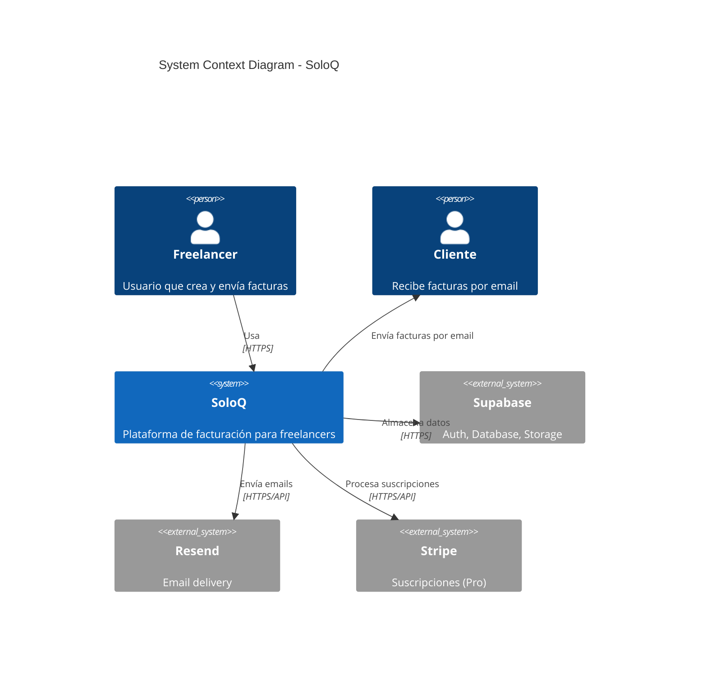

### 1.2 Container Diagram (Level 2)

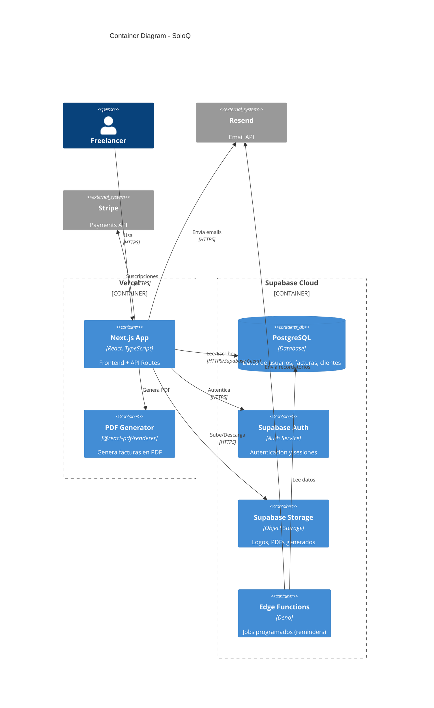

---

## 2. Database Design (ERD)

### 2.1 Entity-Relationship Diagram

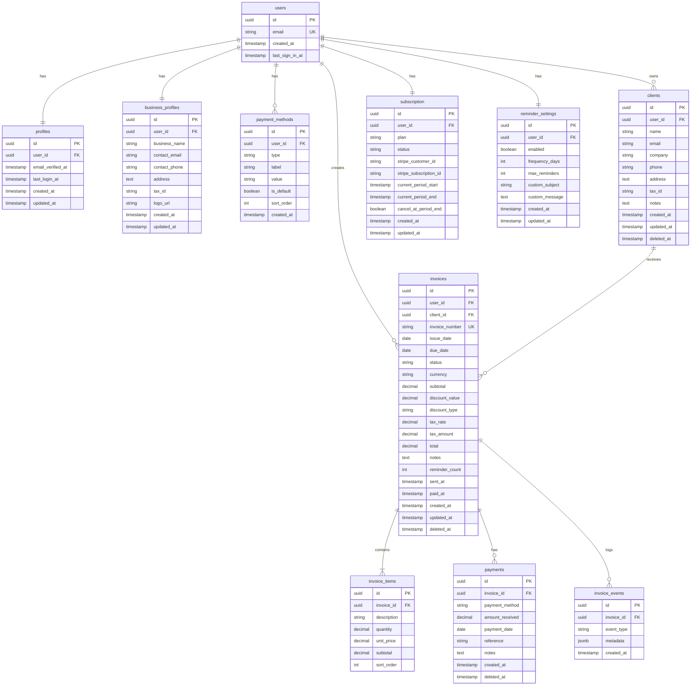

### 2.2 Enums y Tipos

```sql
-- Status de factura
CREATE TYPE invoice_status AS ENUM ('draft', 'sent', 'paid', 'overdue', 'cancelled');

-- Tipo de descuento
CREATE TYPE discount_type AS ENUM ('percentage', 'fixed');

-- Tipo de método de pago
CREATE TYPE payment_method_type AS ENUM ('bank_transfer', 'paypal', 'mercado_pago', 'cash', 'other');

-- Tipo de evento de factura
CREATE TYPE invoice_event_type AS ENUM ('created', 'updated', 'sent', 'reminder_sent', 'viewed', 'paid', 'cancelled');

-- Plan de suscripción
CREATE TYPE subscription_plan AS ENUM ('free', 'pro');

-- Status de suscripción
CREATE TYPE subscription_status AS ENUM ('active', 'canceled', 'past_due', 'incomplete');
```

---

## 3. Tech Stack Justification

### 3.1 Frontend: Next.js 15 (App Router)

| Aspecto | Detalle |
|---------|---------|
| **Por qué elegido** | |
| ✅ Ventaja 1 | React Server Components reduce bundle size y mejora performance |
| ✅ Ventaja 2 | App Router con layouts, loading states, y error boundaries nativos |
| ✅ Ventaja 3 | API Routes integrados (no necesita backend separado) |
| ✅ Ventaja 4 | Excelente DX con fast refresh y TypeScript support |
| ❌ Trade-off | Curva de aprendizaje del App Router vs Pages Router |

### 3.2 Styling: TailwindCSS + shadcn/ui

| Aspecto | Detalle |
|---------|---------|
| **Por qué elegido** | |
| ✅ Ventaja 1 | Utility-first permite rapid prototyping |
| ✅ Ventaja 2 | shadcn/ui provee componentes accesibles y customizables |
| ✅ Ventaja 3 | Consistencia visual garantizada |
| ✅ Ventaja 4 | Bundle optimizado (PurgeCSS) |
| ❌ Trade-off | HTML puede verse "verbose" con muchas clases |

### 3.3 Backend: Supabase

| Aspecto | Detalle |
|---------|---------|
| **Por qué elegido** | |
| ✅ Ventaja 1 | PostgreSQL con RLS para seguridad a nivel de fila |
| ✅ Ventaja 2 | Auth integrado (email, OAuth, magic links) |
| ✅ Ventaja 3 | Storage para archivos (logos, PDFs) |
| ✅ Ventaja 4 | Edge Functions para background jobs |
| ✅ Ventaja 5 | Free tier generoso para MVP |
| ❌ Trade-off | Vendor lock-in (mitigable con standard PostgreSQL) |

### 3.4 Forms: React Hook Form + Zod

| Aspecto | Detalle |
|---------|---------|
| **Por qué elegido** | |
| ✅ Ventaja 1 | Performance (uncontrolled components) |
| ✅ Ventaja 2 | Zod genera tipos TypeScript automáticamente |
| ✅ Ventaja 3 | Validación compartida client/server |
| ❌ Trade-off | Más setup inicial que forms simples |

### 3.5 PDF: @react-pdf/renderer

| Aspecto | Detalle |
|---------|---------|
| **Por qué elegido** | |
| ✅ Ventaja 1 | Render server-side (no carga cliente) |
| ✅ Ventaja 2 | Sintaxis React familiar |
| ✅ Ventaja 3 | Control total del layout |
| ❌ Trade-off | Limitaciones de CSS (no es HTML/CSS real) |

### 3.6 Email: Resend + React Email

| Aspecto | Detalle |
|---------|---------|
| **Por qué elegido** | |
| ✅ Ventaja 1 | React Email permite templates type-safe |
| ✅ Ventaja 2 | Preview en desarrollo |
| ✅ Ventaja 3 | API moderna y bien documentada |
| ✅ Ventaja 4 | Free tier: 3,000 emails/mes |
| ❌ Trade-off | Menos features que SendGrid/Mailgun |

---

## 4. Data Flow

### 4.1 User Registration Flow

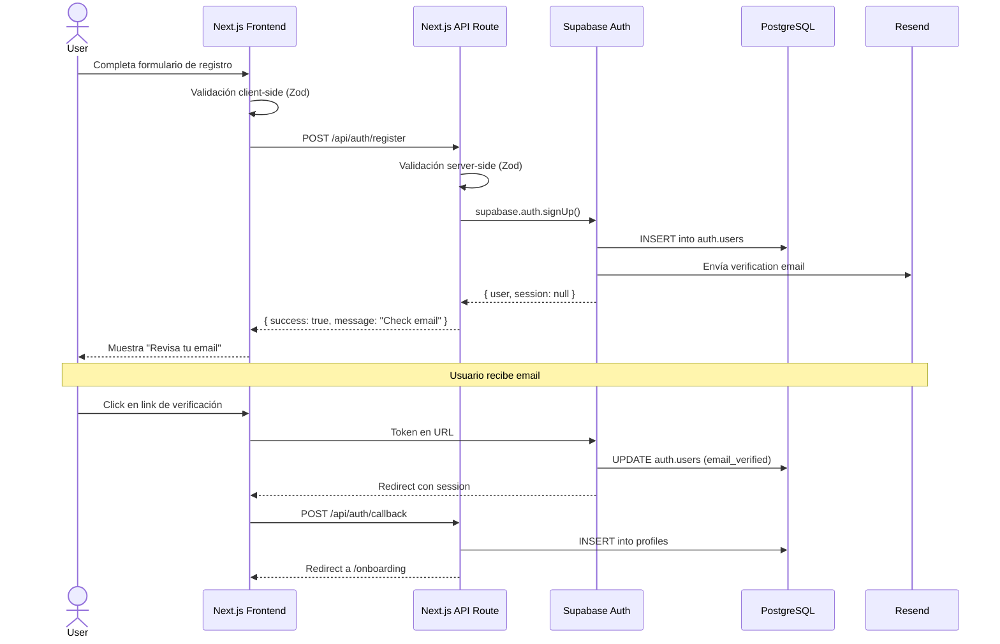

### 4.2 Create and Send Invoice Flow

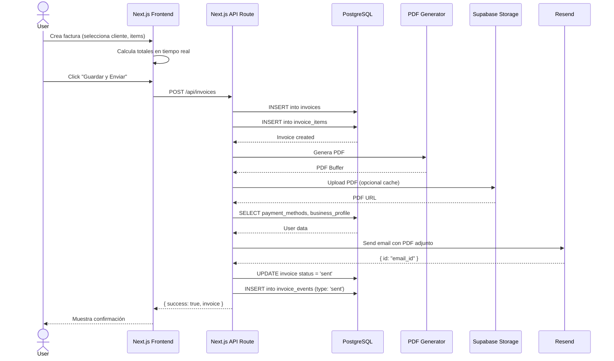

### 4.3 Mark Invoice as Paid Flow

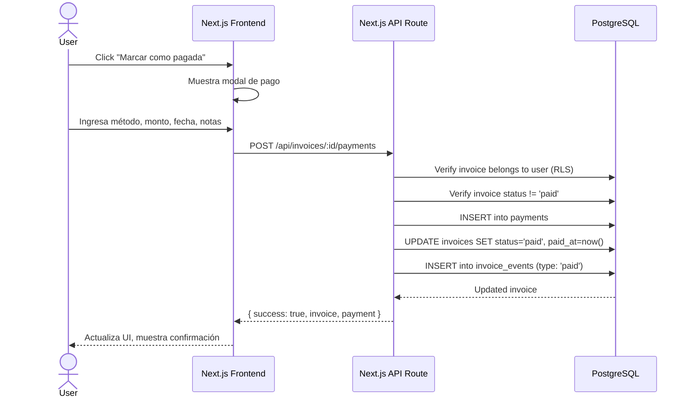

### 4.4 Automatic Reminder Flow (Background Job)

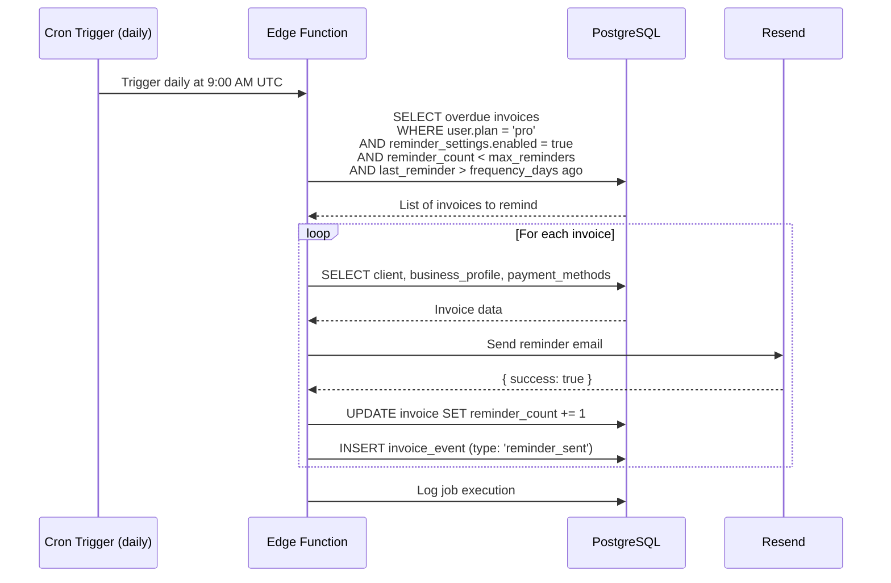

### 4.5 Subscription Upgrade Flow

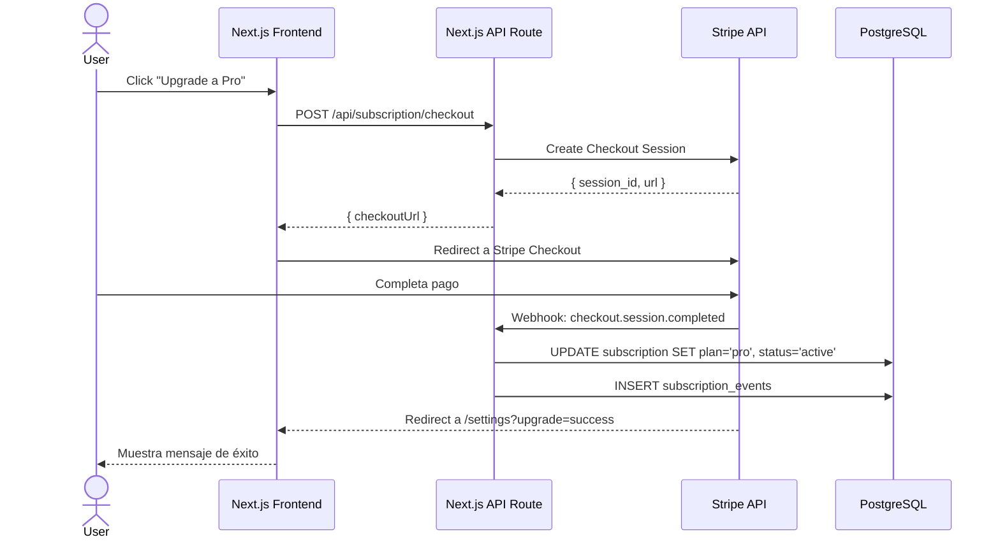

---

## 5. Security Architecture

### 5.1 Authentication Flow

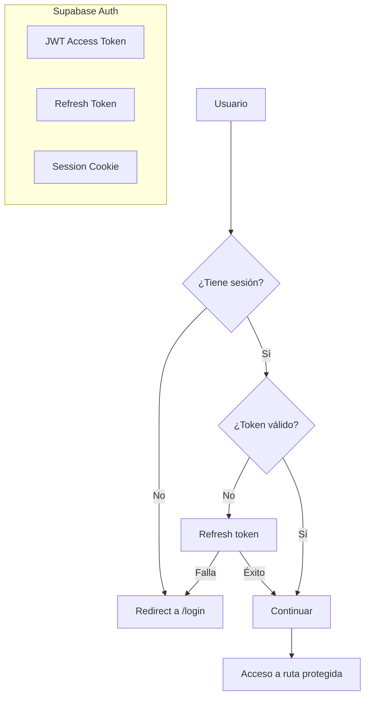

### 5.2 Row Level Security (RLS) Implementation

```sql
-- Habilitar RLS en todas las tablas
ALTER TABLE profiles ENABLE ROW LEVEL SECURITY;
ALTER TABLE business_profiles ENABLE ROW LEVEL SECURITY;
ALTER TABLE payment_methods ENABLE ROW LEVEL SECURITY;
ALTER TABLE clients ENABLE ROW LEVEL SECURITY;
ALTER TABLE invoices ENABLE ROW LEVEL SECURITY;
ALTER TABLE invoice_items ENABLE ROW LEVEL SECURITY;
ALTER TABLE payments ENABLE ROW LEVEL SECURITY;
ALTER TABLE invoice_events ENABLE ROW LEVEL SECURITY;
ALTER TABLE subscription ENABLE ROW LEVEL SECURITY;
ALTER TABLE reminder_settings ENABLE ROW LEVEL SECURITY;

-- Política ejemplo: clients
CREATE POLICY "Users can CRUD their own clients"
ON clients
FOR ALL
USING (auth.uid() = user_id)
WITH CHECK (auth.uid() = user_id);

-- Política ejemplo: invoices
CREATE POLICY "Users can CRUD their own invoices"
ON invoices
FOR ALL
USING (auth.uid() = user_id)
WITH CHECK (auth.uid() = user_id);

-- Política ejemplo: invoice_items (via invoice)
CREATE POLICY "Users can CRUD items of their invoices"
ON invoice_items
FOR ALL
USING (
  EXISTS (
    SELECT 1 FROM invoices
    WHERE invoices.id = invoice_items.invoice_id
    AND invoices.user_id = auth.uid()
  )
);
```

### 5.3 Data Protection

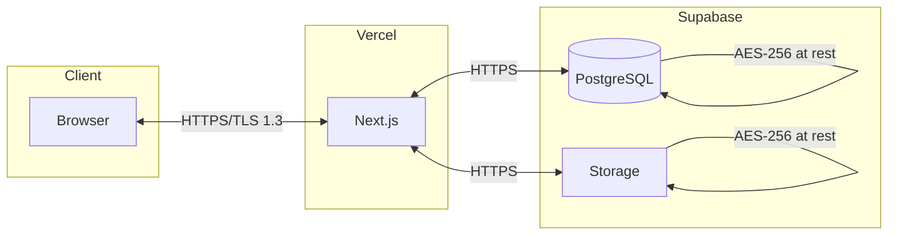

---

## 6. Deployment Architecture

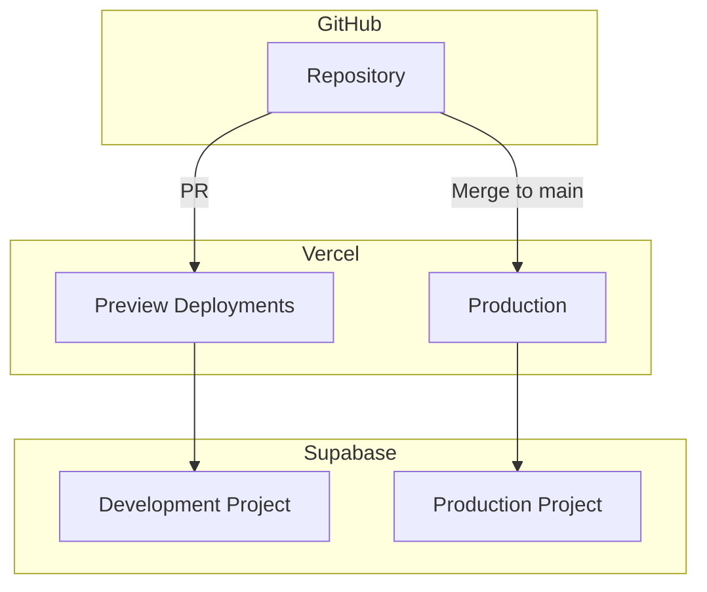

### 6.1 Environments

| Environment | Vercel URL | Supabase Project | Purpose |
|-------------|------------|------------------|---------|
| Development | localhost:3000 | soloq-dev | Local development |
| Preview | *.vercel.app | soloq-dev | PR previews |
| Staging | staging.soloq.app | soloq-staging | Pre-production testing |
| Production | soloq.app | soloq-prod | Live users |

### 6.2 Environment Variables

```env
# Supabase
NEXT_PUBLIC_SUPABASE_URL=
NEXT_PUBLIC_SUPABASE_ANON_KEY=
SUPABASE_SERVICE_ROLE_KEY=

# Resend
RESEND_API_KEY=

# Stripe
STRIPE_SECRET_KEY=
STRIPE_WEBHOOK_SECRET=
NEXT_PUBLIC_STRIPE_PUBLISHABLE_KEY=

# App
NEXT_PUBLIC_APP_URL=
```

---

*Documento parte del SRS de SoloQ - Fase 2 Architecture*
